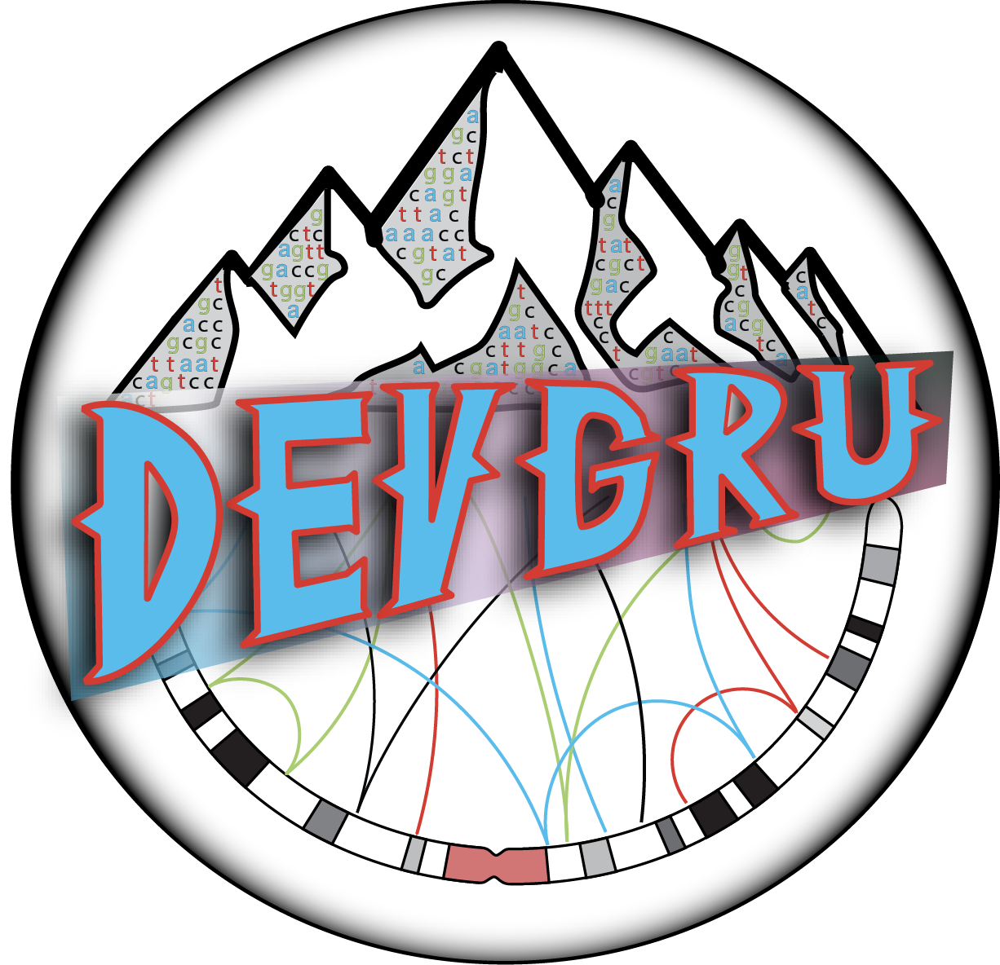

<!-- README.md is generated from README.Rmd. Please edit that file -->

```{r, include = FALSE}
knitr::opts_chunk$set(
  echo = FALSE,
  message = FALSE,
  collapse = TRUE,
  comment = "#>",
  fig.path = "man/figures/README-",
  out.width = "100%"
)
```

# devgru 

<!-- badges: start -->
<!-- badges: end -->

A developmental `R` environment for a suite of `GenomicRanges` utilities

## Installation

You can install `devgru` with:

``` r
devtools::install_github("pblaney/devgru")
```

## Suite of Packages

The current suite of utilites for `devgru` can be quickly installed, if needed, and loaded with:

``` r
kit_loadout()
```

#### GenomicRanges Core
* [`BSgenome.Hsapiens.UCSC.hg38`](https://bioconductor.org/packages/release/data/annotation/html/BSgenome.Hsapiens.UCSC.hg38.html)
* [`GenomicRanges`](https://bioconductor.org/packages/release/bioc/html/GenomicRanges.html)
* [`GenomeInfoDb`](https://bioconductor.org/packages/release/bioc/html/GenomeInfoDb.html)
* [`data.table`](https://cran.r-project.org/web/packages/data.table/vignettes/datatable-intro.html)
* [`mskilab-org/gUtils`](https://github.com/mskilab-org/gUtils)
* [`VariantAnnotation`](https://bioconductor.org/packages/release/bioc/html/VariantAnnotation.html)
* [`rtracklayer`](https://bioconductor.org/packages/release/bioc/html/rtracklayer.html)
* [`Biostrings`](https://bioconductor.org/packages/release/bioc/html/Biostrings.html)
* [`S4Vectors`](https://bioconductor.org/packages/release/bioc/html/S4Vectors.html)

#### Utility Core
* [`dplyr`](https://dplyr.tidyverse.org)
* [`stringr`](https://stringr.tidyverse.org)
* [`readr`](https://readr.tidyverse.org)
* [`ggplot2`](https://ggplot2.tidyverse.org)
* [`ggsci`](https://nanx.me/ggsci/)
* [`paletter`](https://emilhvitfeldt.github.io/paletteer/)
* [`scico`](https://github.com/thomasp85/scico)
* [`flextable`](https://ardata-fr.github.io/flextable-book/index.html)
* [`mclust`](https://cran.r-project.org/web/packages/mclust/vignettes/mclust.html)
* [`parallel`](https://stat.ethz.ch/R-manual/R-devel/library/parallel/doc/parallel.pdf)
* [`doParallel`](https://cran.r-project.org/web/packages/doParallel/doParallel.pdf)
* [`foreach`](https://cran.r-project.org/web/packages/foreach/vignettes/foreach.html)
